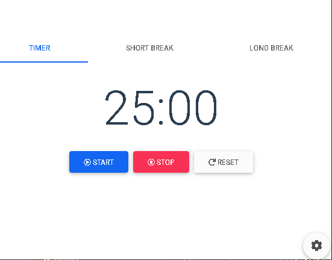

# Pomodoro Clock

This project is following tutorial from Gwendolyn Faraday and I make some changes and adjustment

## Features

1. User can start timer
2. User can stop timer
3. User can reset timer
4. User can choose timer, short break, or long break
5. User can see seconds count down
6. User can set number of minutes for each type of timer
7. The timer will automatically reset if the timer has run out

## Tech Stack

* Vue.js
* Vue CLI
* MBD (Material Design for Bootstrap and Vue)

## Layouts

